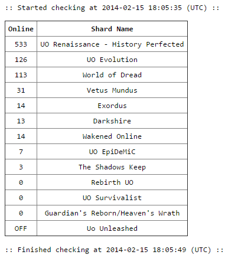
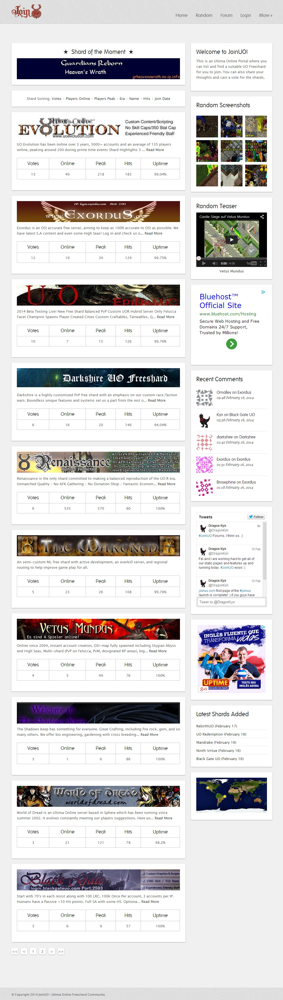

# JoinUO Website + Poller

After droping UO Is Not Dead, I've joined JoinUO team to make a new website in 2014.

All the poller code is on the `poller.php` file. And the database schema is on `joinuo.mwb`.

The site template was not designed by me, it was available for free on the Internet.

## Screenshots

  
_Shard Poller Report._

  
_JoinUO Index on Early Development, February 2014._